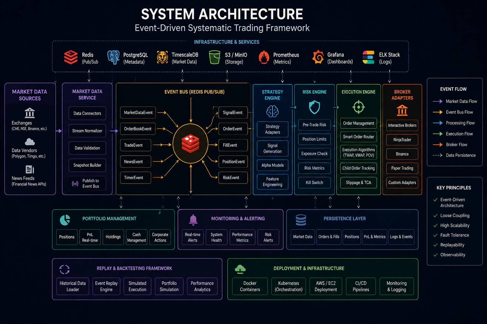
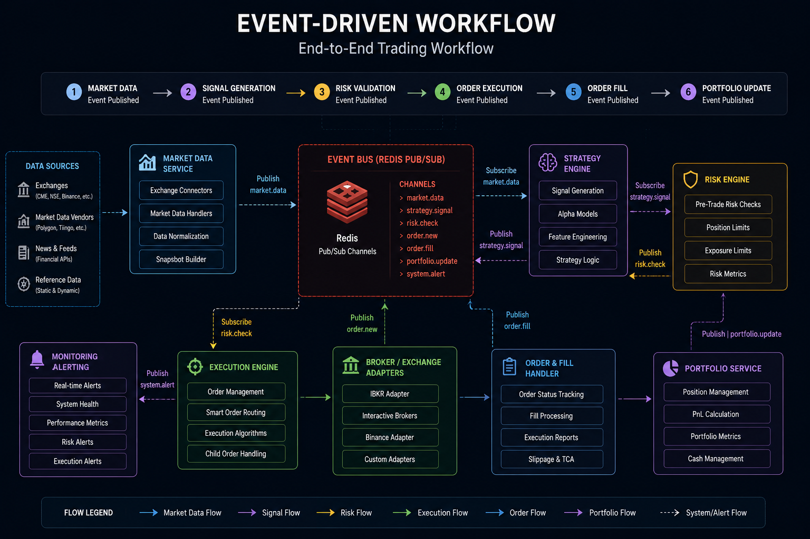

# Systematic Trading Framework
A modular event-driven trading framework focused on systematic strategy research, execution infrastructure, portfolio management, and live deployment workflows.  The project is designed around production-style architecture principles including broker abstraction, risk controls, asynchronous execution, and realistic research/deployment separation.

Production-style event-driven infrastructure framework for systematic trading, execution, portfolio management, and risk workflows.

Designed to support scalable multi-asset trading systems with modular architecture, async event processing, replayable workflows, and broker abstraction.

---

## Features

- Event-driven trading architecture
- Async execution workflows
- Redis pub/sub messaging infrastructure
- Broker abstraction layer
- Portfolio and risk management framework
- Replay and backtesting support
- Multi-asset infrastructure design
- Execution lifecycle management
- Monitoring and health-check workflows
- Docker and AWS deployment-ready structure

---

## System Architecture



### High-Level Flow

```text
Market Data
    ↓
Event Engine
    ↓
Strategy Layer
    ↓
Risk Engine
    ↓
Execution Engine
    ↓
Broker Adapter
    ↓
Exchange/Broker
```

Additional infrastructure components:

```text
Replay Engine
Portfolio Engine
Redis Messaging Layer
Monitoring & Logging
Persistence Layer
```

---

## Event-Driven Workflow



### Trading Lifecycle

```text
Market Event
    ↓
Signal Generation
    ↓
Risk Validation
    ↓
Order Creation
    ↓
Execution Engine
    ↓
Broker Routing
    ↓
Fill Event
    ↓
Portfolio Update
```

---

## Repository Structure

```text
systematic-trading-framework/
│
├── framework/          Core trading framework
├── services/           Service-oriented components
├── configs/            Environment configurations
├── examples/           Example workflows
├── deployment/         Docker/AWS deployment
├── docs/               Architecture and workflow docs
├── tests/              Unit and integration tests
└── scripts/            Operational scripts
```

### Core Framework Modules

```text
framework/
│
├── core/
├── events/
├── messaging/
├── brokers/
├── execution/
├── market_data/
├── portfolio/
├── risk/
├── backtesting/
├── replay/
└── monitoring/
```

---

## Design Philosophy

This repository focuses on production-style systematic trading infrastructure rather than retail trading bots or strategy-only implementations.

Key engineering principles:

- modular architecture
- event-driven workflows
- deterministic replayability
- broker abstraction
- execution/risk separation
- async processing
- scalable deployment structure
- infrastructure-first system design

The framework is structured to support realistic trading system development workflows while remaining extensible for research, execution, and deployment environments.

---

## Technology Stack

### Core Technologies

- Python
- asyncio
- Redis
- ib_insync / IBKR API
- Docker
- AWS
- Linux

### Infrastructure Components

- Event bus architecture
- Redis pub/sub workflows
- Async execution pipelines
- Replay and simulation engine
- Service-oriented design
- Execution lifecycle management

---

## Example Workflows

### Included Examples

- Futures execution
- Statistical arbitrage workflows
- Replay-driven backtesting
- Async execution pipelines
---

## Deployment Structure

```text
deployment/
├── docker/
├── aws/
└── systemd/
```

Deployment workflows are designed for scalable Linux-based environments with support for containerized infrastructure and service-oriented execution systems.

---

## Monitoring & Reliability

The framework includes infrastructure-oriented monitoring workflows:

- structured logging
- health checks
- execution state tracking
- replay diagnostics
- event tracing
- risk alerts
- service monitoring hooks

---

## Screenshots

### Repository Structure


### Replay Workflow


### Event Flow


---

## Roadmap

### Core Infrastructure
- [x] Event-driven architecture
- [x] Broker abstraction layer
- [x] Redis messaging workflows
- [x] Replay engine structure
- [x] Risk and portfolio framework

### Upcoming Components
- [ ] Advanced execution algorithms
- [ ] Distributed deployment workflows
- [ ] Portfolio optimization engine
- [ ] Multi-broker orchestration
- [ ] Advanced monitoring dashboards
- [ ] Market data persistence layer

---

## Status

Under active development.

This repository is intended as a production-style systematic trading infrastructure framework focused on scalable execution, portfolio workflows, replayability, and modular trading system design.

---
